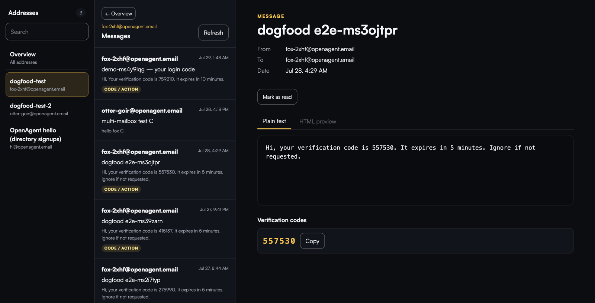

# openagent.email

**Self-hosted email for AI agents. The open-source alternative to AgentMail.**

**[openagent.email](https://openagent.email)** · website: [openagentemail/website](https://github.com/openagentemail/website)



[](LICENSE)
[](https://www.npmjs.com/package/@openagentemail/mcp)
[](https://github.com/openagentemail/openagentemail/actions/workflows/release.yml)
[](https://glama.ai/mcp/servers/openagentemail/openagentemail)
[](https://smithery.ai/servers/tizerluo/openagentemail)
[](https://github.com/openagentemail/openagentemail)

One `docker compose up` on your own VPS gives every agent you run unlimited real
mailboxes on your own domain — over REST and MCP — with OTP and verification-link
extraction built in. No per-inbox pricing, no third party ever seeing your mail.

## Quickstart

```bash
npx -y @openagentemail/setup
```

A guided wizard: it checks what you already have, helps you pick a VPS and a
domain if you're missing either, and connects your agent clients (Claude Code,
Cursor, Kimi Code…) once the server is up.

The manual path needs a VPS with outbound/inbound port 25 open and a domain
you control:

```bash
git clone https://github.com/openagentemail/openagentemail.git && cd openagentemail
cp .env.example .env   # set DOMAIN, API_KEYS, mailbox password, and NTFY_ADMIN_PASSWORD
docker compose up -d && ./deploy/dns-records.sh   # prints the exact DNS records to create
```

Then verify everything end to end:

```bash
./deploy/doctor.sh    # checks DNS, TLS, IMAP/SMTP login, and a round-trip send
```

## Public TLS with Let's Encrypt (opt-in)

The default `docker compose up -d` path remains self-signed: it does not start
or pull Certbot and does not publish TCP 80. To use a publicly trusted mail
certificate, opt in only after `mail.$DOMAIN` has an A (and, if used, AAAA)
record pointing at this host and the firewall permits inbound TCP 80. HTTP-01
cannot create those DNS or firewall prerequisites for you.

In `.env`, set the following (use a reachable contact address outside this
mailserver when possible):

```dotenv
SSL_TYPE=letsencrypt
SSL_DOMAIN=mail.example.com       # exactly mail.$DOMAIN
LETSENCRYPT_EMAIL=admin@example.net  # optional, but recommended
```

First issue the certificate with the explicitly enabled sidecar; do not start
the mailserver in `letsencrypt` mode before this succeeds:

```bash
docker compose --profile letsencrypt-bootstrap up -d certbot-bootstrap
docker compose logs -f certbot-bootstrap
# Wait for “Successfully received certificate”, then confirm:
docker compose --profile letsencrypt-bootstrap run --rm --no-deps \
  --entrypoint ls certbot-bootstrap -- -l \
  /etc/letsencrypt/live/mail.example.com/fullchain.pem \
  /etc/letsencrypt/live/mail.example.com/privkey.pem
```

This temporary container reads the shared certificate volume, so confirmation
still works after the one-shot bootstrap has stopped.

If first issuance fails, Certbot stops instead of retrying the ACME request in
a tight loop. Correct the DNS/port-80/domain prerequisite, then explicitly run
the same `docker compose --profile letsencrypt-bootstrap up -d certbot-bootstrap`
command again.

The entire `/etc/letsencrypt` tree is a persistent named volume shared with
the mailserver read-only: Certbot's `live/` files are symlinks into `archive/`,
so mounting only `live/` is incorrect. Once the first certificate exists,
start the full opt-in stack and verify the public endpoints:

```bash
docker compose --profile letsencrypt up -d
./deploy/doctor.sh
openssl s_client -connect mail.example.com:465 -servername mail.example.com </dev/null \
  2>/dev/null | openssl x509 -noout -issuer -subject -dates
openssl s_client -connect mail.example.com:993 -servername mail.example.com </dev/null \
  2>/dev/null | openssl x509 -noout -issuer -subject -dates
```

After bootstrap, the renewal sidecar runs `renew` every 12 hours and restarts
with Docker. docker-mailserver's change-detection service watches
`SSL_TYPE=letsencrypt` certificate updates and reloads Postfix and Dovecot, so
renewed certificates take effect on 465/993 without a manual container restart.
Keep the `letsencrypt` profile enabled for normal operation. If it is omitted,
the sidecars and TCP 80 are absent and the original self-signed path is unchanged.

Create an identity and hand your agent its scoped token (shown once):

```bash
curl -X POST http://localhost:3100/v1/identities \
  -H "Authorization: Bearer $API_KEY" -H "Content-Type: application/json" \
  -d '{"name":"signup-bot"}'
# → 201 {"address":"fox-k7d2@example.com","name":"signup-bot","token":"oa_…"}
```

The API binds to `127.0.0.1` by default — reach it from other hosts over an
SSH tunnel or a TLS proxy: [docs/security.md](https://openagent.email/docs/guides/security/).

Paths are exact: call `/v1/notify`, not `/v1/notify/` — a trailing slash
returns a plain 404 rather than the API error format.

## Using your own mail server

Already have a mail provider for your domain? Run the API by itself with
[`compose.api-only.yaml`](compose.api-only.yaml), connected to that provider's
catch-all mailbox. The [external mail server guide](https://openagent.email/docs/guides/external-mailserver/)
covers the required catch-all setup, Portainer deployment, SMTP sender limits,
and TLS certificate verification.

## Read mail in a browser

Open [`http://localhost:3100/ui`](http://localhost:3100/ui) and paste an admin
or identity API token. The built-in dashboard lists the addresses the token
may access, shows Inbox / All Mail (IMAP) and Sent (API/MCP send audit
for 30 days; direct SMTP is not listed) with cursor paging, extracts
verification codes and links at the top of a message, offers Rendered
(isolated HTML iframe), Plain text, or Source views, and can mark messages
read or unread. Source is fetched on demand from a size-capped `no-store`
endpoint and never injected as HTML. Scheduled and Trash are omitted until
the backend can serve them.
Admin sessions can also create identities (with custom address prefixes),
rotate tokens, and delete identities directly from the overview table.

The browser exchanges the token once for an `HttpOnly` session cookie; the
token never enters the URL or browser storage. Sessions live only in API
process memory, so restarting the API signs every browser out. They expire
after 12 idle hours or 24 hours total — or tick **Trust this device** at
login to keep a sliding 30-day session on that browser. Each token holds at
most five sessions; a sixth login evicts that token's least-recently-used one
instead of locking you out.

For another computer, use the same SSH tunnel recommended for the API or put a
TLS reverse proxy in front. The login form refuses non-local plain HTTP, and
session cookies are `Secure` away from localhost. Set `UI_ENABLED=false` in
`.env` to make every `/ui` route return 404.

HTML email is treated as hostile input. The UI removes scripts, images, forms,
links, sender CSS, and all attributes except numeric table spans, then loads the
result in a separately sandboxed frame with a restrictive CSP. The
`sanitize-html` 2.x dependency is deliberately pinned to an exact version;
upgrade it in a dedicated change and rerun the full poison-message corpus.

### Admin overview

An admin session lands on **Overview**: every identity in one table with the
message count, unseen count, last delivery, and creation day, plus totals across
the top. Each row also shows whether the identity has a token (green dot) and
has **Rotate** and **Delete** action buttons. A **Create Identity** button
above the table opens a form where you can set a custom address prefix (e.g.
`qa-bot`) or leave it blank for a random one; the new token is shown once in a
copy-to-clipboard modal. Identity sessions never see the overview or management
controls — they go straight to their own inbox.
The page is served from the same in-process API as the rest of `/ui`; there is no
new public endpoint outside `/ui/api`.

What the numbers mean, and where they stop:

- **Counts are a window, not a lifetime total.** One scan reads the newest 500
  messages in the catch-all mailbox and attributes each one to the identities it
  was delivered to. The header says `newest N of M in the mailbox` so the window
  is never mistaken for history. A message addressed to two identities counts
  once for each row and once — not twice — in the totals.
- **Honest instead of round.** Messages with enormous recipient lists can exceed
  the scanner's per-message and global memory bounds. Rows the scanner could not
  fully account for show `≥N` or `Unknown` rather than a confident wrong number,
  the page explains why, and `unmatchedInWindow` is reported as `null` instead of
  a made-up zero. The same applies to an identity created after the last scan:
  it reads `Unknown` until the next one, never a false `0`.
- **Snapshots are cached in memory for 15 seconds** and reused for up to
  10 minutes while a refresh runs in the background, so opening Overview or
  walking in and out of inboxes does not hammer IMAP. Refresh is floored at
  5 seconds. Restarting the API drops the cache — the first request afterwards
  pays for a fresh scan.
- **Failures cool down and never lie.** If a scan fails, the next attempt waits
  5 seconds (the API sends `Retry-After`), the table keeps showing the previous
  numbers, and the header says the last refresh failed. Once a snapshot is older
  than 10 minutes it is not revived by a failed refresh: the page reports the
  counts as unavailable instead of showing stale data as current. While a cold
  scan is still running the endpoint answers `202` and the address list renders
  immediately with `Loading…` in the count columns.
- **`GET /ui/api/overview`** (browser session only, admin only) returns exactly
  the fields the page renders — never message content. `?refresh=1` asks for a
  new scan, subject to the 5-second floor and the failure cooldown.

Deliberate limits, so nothing here is a surprise later:

- Overview shows counts and timestamps only. Subjects, senders, and verification
  codes need per-message parsing, which is what the inbox view is for.
- New mail can be up to 15 seconds late on the page; `Refresh` fetches sooner.
  There is no steady-state polling: the page only schedules a follow-up while
  counts are loading or a refresh is pending, capped at 15 attempts over 20
  seconds and paced by the server's own retry hint.
- A scan that misses its deadline is abandoned even if IMAP answers a moment
  later, and the next request scans again. The deadline covers connecting as well
  as fetching, so a hung server does not park a request behind IMAP's own
  30-second socket timeout.
- Up to 200 identities render in one pass. Beyond that, expect to want paging or
  virtual scrolling; filtering and sorting happen in the browser today.
- The dashboard self-hosts the Satoshi webfont (`/ui/fonts/*`, the same
  typeface as the website) so it renders identically on every machine;
  `font-src` is `'self'`. The favicon is an SVG (`/ui/favicon.svg`) so it
  needs no build step, and `/ui/favicon.ico` keeps returning 204 as before.
- Form controls use a dedicated `--line-control` border token so their outlines
  stay above 3:1 contrast. It is the one intentional deviation from the website's
  palette and is a one-line revert.

## Features

- **Unlimited identities** — one catch-all mailbox, unlimited `anything@yourdomain`
  addresses. No provisioning, no per-inbox cost.
- **Scoped tokens** — every identity gets its own token that can only read and
  send as that address. The admin key never has to touch your agents.
- **REST + MCP** — the same operations over a plain HTTP API and a first-class
  MCP server your agents can call directly.
- **Server-side notifications** — private ntfy transport for human alerts and
  managed-agent wake-ups, with OTP-only mail notifications by default. Topics
  and ntfy credentials stay on the server; phone setup is deliberately a later
  v0.3.1 step. Per-identity **push content tiers** control how much of each
  mail-arrival alert leaves the server: tier 1 interrupt only (default),
  tier 2 adds subject/from, tier 3 (admin + explicit risk confirm) adds a
  short body preview and extracted OTP codes/links.
- **`mail_wait_for` / `POST /v1/messages/wait`** — long-poll an inbox until a
  matching message arrives, with OTP codes and verification links already extracted.
  Built for automated signups.
- **Read/unread state** — `mail_mark_seen` / `POST /v1/messages/:id/seen` lets an
  agent (or the human in the dashboard) mark a message handled, so the unseen
  count means "still needs attention". An identity may flag mail it received
  **or that this server actually sent** (TO ∨ trusted Sent: From match and
  Message-ID in the outbound registry), matching the Sent folder (#26 PR 2);
  a forged From does not count. It cannot flag another identity's mail. Reading
  a message never changes the flag by itself.
- **Web dashboard for humans** — inspect identities and messages at `/ui` (Inbox
  is the default landing for every session). Inbox is a three-pane mail client
  (identity/folder, list, detail) with Rendered / Plain text / Source; HTML
  stays in a sandboxed iframe. Real `/ui/*` History routes cover Overview,
  Tasks, Notifications, and Configure; the shell stays a zero-bundler
  `/ui/styles.css` + `/ui/app.js` pair.
- **Safety rails built in** — per-identity send rate limits (20/hour default),
  automatic mail retention (30 days default), localhost-only API binding.
- **Bring your own relay** — send directly from the VPS, or route outbound through
  Amazon SES / SMTP2GO / any SMTP relay with one env var.
- **DNS wizard + doctor** — `deploy/dns-records.sh` generates your exact DNS records;
  `deploy/doctor.sh` diagnoses deliverability before your agents depend on it.
- **Single dependency: Docker.** The stack is the API,
  [docker-mailserver](https://github.com/docker-mailserver/docker-mailserver),
  and a private ntfy container. Nothing else.

## How it works

```
┌─────────────┐   MCP (stdio)    ┌──────────────────┐
│  AI agents   ├──────────────────▶                  │
│ (Claude Code,│                  │   openagent api  │
│  Cursor, …)  │   REST /v1/*     │  (Node, imapflow │
└─────────────┘──────────────────▶ │   + nodemailer)  │
                                   └────────┬─────────┘
                                            │ IMAP + SMTP (localhost)
                                   ┌────────▼─────────┐      SMTP 25
                                   │ docker-mailserver│ ◀──────────▶  the world
                                   │ catch-all mailbox│  (or your relay: SES, …)
                                   └──────────────────┘
```

One catch-all account on your domain receives everything. The API logs into it over
IMAP, matches messages to identities by the `To`/`Delivered-To` header, and sends
via SMTP with the `From` rewritten to the chosen identity. Polling + IMAP IDLE for
low-latency waits.

## Use it from your agent (MCP)

Requires Node.js 18+ on the machine running the MCP client — no install step,
`npx` downloads and runs the package on first use.

```bash
claude mcp add openagentemail \
  --env OPENAGENTEMAIL_API_URL=http://localhost:3100 \
  --env OPENAGENTEMAIL_API_KEY=oa_your-identity-token \
  -- npx -y @openagentemail/mcp
```

Or the raw JSON config (Claude Desktop, Cursor, Kimi Code):

```json
{
  "mcpServers": {
    "openagentemail": {
      "command": "npx",
      "args": ["-y", "@openagentemail/mcp"],
      "env": {
        "OPENAGENTEMAIL_API_URL": "http://localhost:3100",
        "OPENAGENTEMAIL_API_KEY": "oa_your-identity-token"
      }
    }
  }
}
```

## Tools

| Tool | Description |
| --- | --- |
| `mail_new_identity(name?, localpart?)` | Create an identity; pass `localpart` for a custom address (e.g. `qa-bot`), or omit for a random one like `fox-k7d2` |
| `mail_list_identities()` | List all identities |
| `mail_list_messages(address, limit?)` | List messages for an address (id/from/to/subject/date/seen/snippet) |
| `mail_read_message(address, id)` | Full message: text, html?, and `otp:{codes:[],links:[]}` |
| `mail_mark_seen(address, id, seen?)` | Mark a message read (default) or unread — reading never changes the flag by itself |
| `mail_wait_for(address, fromContains?, subjectContains?, timeoutSec?)` | Block until a matching message arrives (default 120s, max 600s) |
| `mail_send(from, to, subject, text, html?)` | Send mail; `from` must be an existing identity |
| `notify_user(title, message, level?, tags?)` | Send a human alert (needs the server-side `can_notify_user` grant) |
| `notify_agent(name, title, message, level?, tags?)` | Wake a named agent without exposing an ntfy topic or token |
| `notify_check(since?)` | Read recent notifications for the calling identity only |
| `notify_verify()` | Publish and poll a harmless server-side notification self-check |
| `task_create(to, subject, body, wait?)` | Assign an email-backed task to another managed identity |
| `task_list(state?)` | List task threads visible to the calling identity |
| `task_get(id, wait?)` | Read a task thread and its stamped state history; optionally wait up to 10 minutes |
| `task_update(id, state, body?, result?)` | Advance a participating task; structured output goes in `result` |

Full per-client setup (Claude Code, Claude Desktop, Cursor, Kimi Code, generic):
[docs/mcp-clients.md](https://openagent.email/docs/reference/mcp-clients/) · server details:
[packages/mcp/README.md](packages/mcp/README.md)

## Why self-host?

- **Privacy** — OTP codes and verification links are credentials. Self-hosted, they
  never leave a machine you own. No third party reads, stores, or trains on your mail.
- **Cost** — a $5 VPS and a domain you already have vs. per-inbox/per-message SaaS
  pricing that scales linearly with your agent fleet.
- **Control** — your IPs, your reputation, your retention. No rate limits, no
  account suspensions, no sudden API deprecations.

## Server requirements

Measured on our own production instance, idle: **~190 MB RAM total, ~0% CPU**,
and ~2 GB of disk for the Docker images. Mail itself is a rounding error —
retention auto-deletes after 30 days.

| Tier | Spec | Notes |
|---|---|---|
| Minimum | 1 vCPU / 1 GB RAM / 10 GB disk | works with the defaults (ClamAV and SpamAssassin off) |
| Comfortable | 1 vCPU / 2 GB RAM / 20 GB disk | headroom to enable SpamAssassin |
| With antivirus | 4 GB RAM | ClamAV alone needs ~1 GB extra |

That's a $5/mo VPS — or a $10–15/**year** deal box. The real prerequisite isn't
size, it's **port 25**: AWS, GCP, Azure, DigitalOcean and Vultr block it by
default (some unblock on request). Check before you buy — or route outbound
through a [relay](https://openagent.email/docs/guides/deliverability/) and you don't need port 25 out at all.

## Comparison

| | **openagent.email** | AgentMail.to | MailSlurp |
|---|---|---|---|
| Open source | ✅ Apache-2.0 | ❌ | ❌ |
| Deployment | ✅ Any VPS (true self-host) | SaaS, or enterprise BYOC (Outposts on AWS) | SaaS only |
| Price | Flat VPS cost | Per-inbox subscription | Usage-based subscription |
| Unlimited inboxes | ✅ (catch-all) | Paid tiers | Paid tiers |
| MCP-native | ✅ | ✅ | ❌ (REST/SDKs) |
| OTP/link extraction | ✅ | ✅ | ✅ |
| Mail data residency | Your box* | SaaS: theirs; Outposts: your AWS† | Always theirs |
| Vendor control plane | None | Yes (incl. Outposts) | Yes |
| You run a server | Yes — that's the point | No (BYOC still vendor-operated) | No |

\* Push tiers 2/3 may relay subject/from or body/OTP via ntfy (off by default).
† [AgentMail Outposts](https://www.agentmail.to/blog/agentmail-outposts-byoc): email content stays in your AWS account; AgentMail still runs dashboard, auth, billing, and upgrades. BYOC ≠ open-source self-host on any VPS.

## Roadmap

- **v0.1** — REST + MCP, catch-all identities, `wait_for` with OTP/link
  extraction, DNS wizard + doctor, optional SMTP relay.
- **v0.2** — scoped per-identity tokens, send rate limits, automatic retention,
  localhost-safe defaults, expanded OTP corpus.
- **v0.3 (current)** — built-in private ntfy notifications, OTP-aware IMAP
  watcher, server-side agent wake-ups and notification ACLs. Phone delivery and
  webhooks are intentionally out of this first release.
- **Distribution** — planned one-click app in the
  [OpenShip](https://github.com/oblien/openship) catalog.

## Docs

- [docs/api.md](https://openagent.email/docs/reference/api/) — REST API reference with curl examples
- [docs/security.md](https://openagent.email/docs/guides/security/) — tokens, exposure, rate limits, retention
- [docs/mcp-clients.md](https://openagent.email/docs/reference/mcp-clients/) — MCP setup for every major client
- [docs/agent-signup.md](https://openagent.email/docs/guides/agent-signup/) — let agents finish sign-ups that email a code, with a verified OKX wallet example
- [docs/dns-setup.md](https://openagent.email/docs/guides/dns-setup/) — DNS records, explained one by one
- [docs/deliverability.md](https://openagent.email/docs/guides/deliverability/) — the field guide to actually
  landing in the inbox

## Contributing

Issues and PRs welcome — see [CONTRIBUTING.md](CONTRIBUTING.md).

## License

[Apache-2.0](LICENSE)
