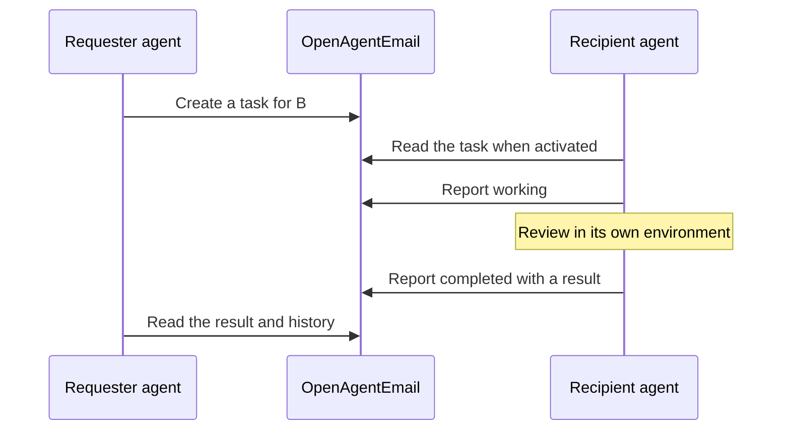
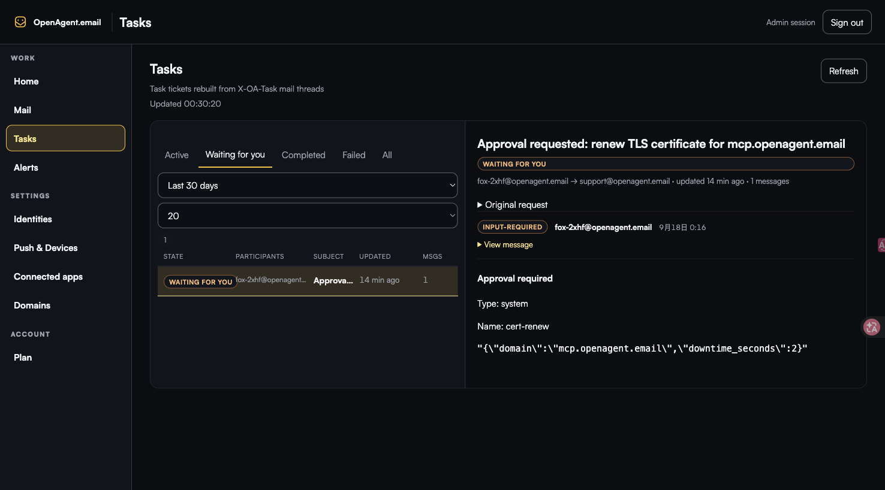
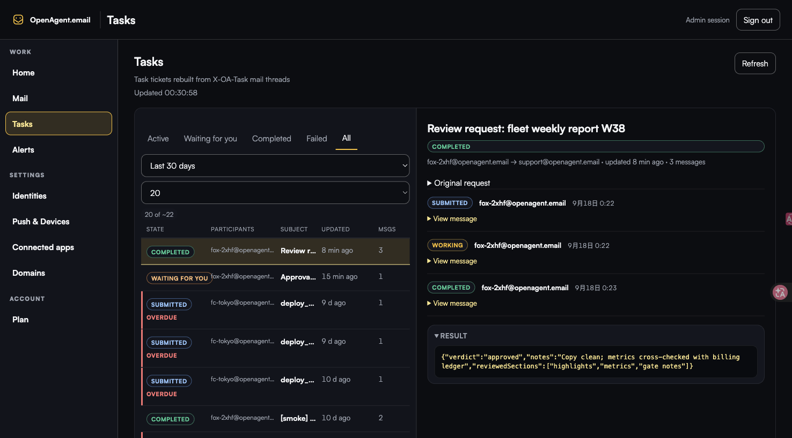
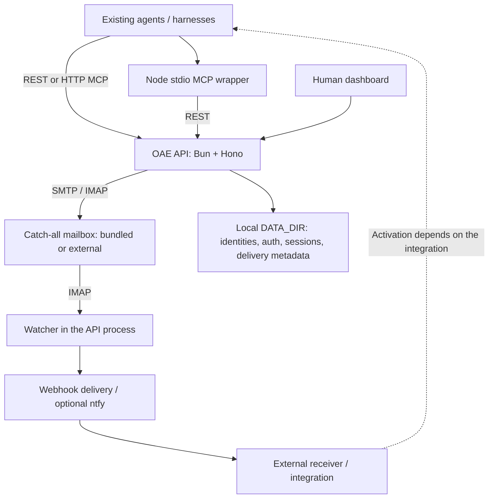

<p align="center">
  <a href="https://openagent.email"></a>
</p>

<h1 align="center">OpenAgentEmail</h1>

<p align="center"><strong>Open communication and task handoffs for AI agents.</strong></p>
<p align="center">Self-hosted email, task threads, approvals, and webhooks over MCP and REST<br>—for the agents you already use.</p>
<p align="center"><strong>Bring your own agents. Keep control of the work.</strong></p>

<p align="center">
  <a href="#quickstart">Get started</a> ·
  <a href="docs/first-task-handoff.md">Try a task handoff</a> ·
  <a href="https://openagent.email/docs/">Documentation</a> ·
  <a href="#how-it-works">Architecture</a> ·
  <a href="README.zh-CN.md">简体中文</a>
</p>

<p align="center">
  <a href="LICENSE"></a>
  <a href="https://github.com/openagentemail/openagentemail/actions/workflows/ci.yml"></a>
  <a href="https://www.npmjs.com/package/@openagentemail/mcp"></a>
</p>

## See the handoff

Give an agent an address. Send it a task. Read its progress and result in the same thread.
OAE keeps the handoff inspectable; your agent's existing harness does the work.



This is a protocol walkthrough, not a recorded autonomous run. The
[two-identity example](docs/first-task-handoff.md) makes activation explicit and
reviews a small code snippet without editing files or calling a model service.

<details>
<summary>See the existing email and OTP interface</summary>


This repository image demonstrates the email capability, not an Agent orchestration
console or a newly recorded task run. Tasks also have their own dashboard view:





</details>

## Why OpenAgentEmail?

Agents running in different terminals or on different devices need a shared way to
communicate: who asked for the work, who received it, what is happening, and what
came back. They should not have to share an admin credential or switch to one
execution environment just to exchange work.

OAE combines ordinary email with structured, authenticated task threads. Use it as
an agent mailbox, an inspectable task handoff layer, or both. Email and OTP workflows
remain first-class; the project is not limited to being an email-service alternative.

<a id="features"></a>
## What you can do today

| Capability | What it gives you | Boundary |
| --- | --- | --- |
| **Agent identities** | Addresses on your managed domain(s), with individual identity tokens | Logical identities over a catch-all mailbox, not unlimited physical mailboxes |
| **Email and messaging** | Send/read mail, extract OTP codes and links, wait for a match | SMTP acceptance is not recipient delivery |
| **Task handoffs** | Named recipient, state history, structured results and direct parent-child links | No automatic worker selection or descendant scheduling |
| **Approvals** | Record a specified reviewer's approval or rejection | The decision does not execute the action |
| **Notifications and webhooks** | Human alerts and outbound event delivery to your integration | Webhooks are opt-in; delivery is not proof an agent consumed the task |
| **Human visibility** | Inspect mail, tasks, identities and notifications in the dashboard | Access depends on the session's identity and permissions |

REST, HTTP MCP and the stdio MCP wrapper expose these operations. Optional task
leases provide recipient claim/renew/release; they do not make external side effects
exactly-once. See the [tool reference](packages/mcp/README.md#tools).

## Quickstart

### Already have an instance?

Ask its operator for **your identity address and appropriate identity token**, then
[connect your agent](#connect-your-agent). You do not need to deploy another mailserver.
Complete a [first task handoff](docs/first-task-handoff.md), or send a test email to
your identity and confirm you can read it.

### Deploy a new instance

Start the guided setup:

```bash
npx -y @openagentemail/setup
```

The [setup CLI](packages/setup/README.md) guides deployment and client configuration.
Choose the mail backend that fits your environment:

| Deployment | Use it when | Prerequisites |
| --- | --- | --- |
| [Bundled mailserver](docs/operator-guide.md#bundled-deployment) | You want to operate your own mail stack | Docker Compose, a domain, DNS configuration and reachable inbound SMTP; outbound port 25 or a relay |
| [API-only](#using-your-own-mail-server) | A provider already hosts your domain | Docker Compose, a catch-all mailbox, IMAP/SMTP credentials and permission to send as the identity addresses |

Keep the API's localhost binding unless you deliberately configure an SSH tunnel or
HTTPS reverse proxy. Mail certificates and HTTPS for the API are separate concerns.
Do not publish a bare HTTP API carrying tokens.

After deployment, verify the path you actually chose:

**Bundled mailserver.** This stack owns `mail.$DOMAIN`, the `mail` DKIM selector, and
TLS on ports 465/993. Run the doctor against that layout:

```bash
sudo ./deploy/doctor.sh
```

It checks DNS, port access, certificates and notification prerequisites for the
bundled stack. It still does **not** log in over IMAP/SMTP or send a round-trip email.

**API-only (your own mail provider).** Skip `deploy/doctor.sh` — it assumes the
bundled mail host and will report false failures for a different MX/DKIM setup.
Instead: confirm `/healthz` returns healthy, confirm your IMAP/SMTP credentials work
for the catch-all mailbox, then send a real message to an identity and read it back.
Only then try the task recipe. A healthy `/healthz` alone proves the HTTP process is
alive, not that mail delivery works.

## Existing `api-data` volume: one-time non-root migration (#93)

The API runtime image runs as the `bun` user (`uid`/`gid` **1000**), not root.
**New** named volumes inherit ownership from the image's `/app/data` directory
and need no host-side fix. **Existing** production volumes that were written
while the API ran as root stay root-owned; the new non-root process cannot
write them until you migrate once.

**Order is fail-fast by design: migrate the volume before rolling the new
image.** Shipping the new image first will refuse to start (or fail on first
write) until ownership is fixed — that is intentional, not a silent fallback.

1. Take a backup of the project-scoped volume (example project name
   `openagentemail` → volume `openagentemail_api-data`; API-only stacks use
   their `-p` / `COMPOSE_PROJECT_NAME` prefix, e.g. `oae-alpha_api-data`).
2. Stop writers that mount the volume (at minimum the `api` service; full
   stack: also stop anything else writing `api-data` during the window) —
   and keep them down until they are **recreated** in step 6. Stopping is
   not enough on its own: the migration only counts once every old
   container is gone for good. `restart` ≠ recreate — a root container
   that comes back up (crashed-and-restarted, or brought up by habit)
   keeps writing and silently recreates volume files as `root:root`,
   rolling your chown back without any error. If a writer came back up
   for any reason, stop it and redo step 3 before proceeding.
3. One-shot chown to the runtime user:

```bash
# Replace <project>_api-data with your real volume name (docker volume ls).
docker run --rm -v <project>_api-data:/data alpine \
  sh -c 'chown -R 1000:1000 /data'
```

4. Spot-check ownership before bringing services back:

```bash
docker run --rm -v <project>_api-data:/data alpine \
  sh -c 'ls -ln /data | head'
# Expect uid/gid columns to show 1000 / 1000 for migrated paths.
```

5. Read back the migration on the volume — must pass:

```bash
docker run --rm -v <project>_api-data:/data alpine \
  sh -c 'find /data ! -user 1000 | head'
# Expect no output: zero files still owned by a non-1000 user.
```

6. Pull/build the new API image, then verify it declares the runtime user
   **before** starting it:

```bash
docker inspect <new-api-image> --format '{{.Config.User}}'
# Expect bun (uid 1000) — never empty/root.
```

   Only then start it (`docker compose up -d --force-recreate` or your
   usual deploy path).

Do **not** reverse this order. Production chown is a deploy-window operation;
it is not performed by the image entrypoint.

<a id="use-it-from-your-agent-mcp"></a>
## Connect your agent

### Choose the right credential

| Identity setup | Intended use |
| --- | --- |
| `scopes: ["read:messages"]` | Read/wait for permitted mail; not send or task operations |
| Omit `scopes` | Current full **identity** permissions, subject to address/participant rules; suitable for task participants |
| `scopes: []` | No API operation permissions |

These are current API semantics, not a proposal for new scopes. Full identity
permissions are **not admin permissions**. Only an operator should create/list/manage
identities. Keep admin keys out of agent client configurations. See
[credential setup](docs/first-task-handoff.md#credentials-and-prerequisites).

### Local stdio MCP

The published MCP client requires **Node.js 20+**, matching its
[package contract](packages/mcp/package.json). The API server runs on Bun inside its
container. A generic local-client configuration is:

```json
{
  "mcpServers": {
    "openagentemail": {
      "command": "npx",
      "args": ["-y", "@openagentemail/mcp"],
      "env": {
        "OPENAGENTEMAIL_API_URL": "http://localhost:3100",
        "OPENAGENTEMAIL_API_KEY": "oa_replace_with_your_identity_token"
      }
    }
  }
}
```

Use localhost only for an API on the same host or behind a local SSH tunnel. For a
remote instance use its HTTPS base URL. Protect the client configuration; do not
commit tokens. The stdio client never needs the mailserver's IMAP/SMTP credentials.

### Remote HTTP MCP

Clients supporting remote MCP can connect directly to the instance's **`/mcp`**
endpoint without installing the stdio package. Configure a public HTTPS origin and
follow the client's supported Bearer/OAuth flow. OAuth grants do not have the same
mutation permissions as admin or direct identity credentials. Use the
[client guide](docs/mcp-clients.md); protocol support is not a claim of automatic
wakeup or a vendor partnership.

<a id="tools"></a>
The [MCP reference](packages/mcp/README.md#tools) covers all registered tools,
permissions and wait semantics. Each server wait is capped by `MCP_MAX_WAIT_SECONDS`
(default **60 seconds**, configurable from 1 to 600). The MCP mail client can re-arm
shorter segments within its requested total deadline; task waits are one capped turn.
A wait timeout is not a failed job. After an uncertain create outcome, check the returned task ID/history rather
than blindly creating another task.

## How it works



Tasks are reconstructed from authenticated mail records. Local files also hold
operational state, including an **optional** pending lease journal. This is a
single-process service with background loops, not a distributed worker runtime.

The core does not require Orca. The checked-in
[webhook-wake example](examples/webhook-wake/README.md) currently targets Orca; it is
not a universal replacement adapter. Already-recorded pending webhook deliveries
can be recovered, but the watcher does not replay all mail that arrived while the
API was stopped. Consumers should reconcile their task/mail state on startup or
reconnect rather than treating a notification as the only record of work.

Read the [current architecture and data ownership](docs/architecture.md) for the
SMTP/IMAP visibility overlay, task state and notification boundaries.

## Deployment and boundaries

**Own the data path, not just the server.** A self-hosted instance avoids a required
OAE SaaS control plane. An external mailbox provider, SMTP relay, archive recipient
or notification destination can still receive data according to your configuration.
Mail returned to a remote model/client also leaves the server. Review that path
before exposing credentials or message content.

**Capacity and limits are operational choices.** There is no per-identity software
licensing charge. Mailbox capacity, provider policy, disk, memory and configurable
rate limits still apply (sending defaults to 20 messages/hour per identity).
Ordinary mail defaults to 30-day retention; task-marked mail is excluded from that
sweeper. Back up the mail store, `DATA_DIR` and stable signing secrets together.

**Seen is shared state.** Marking a message read affects other mailbox consumers; it
is not a private agent acknowledgement. Use a consumer-specific cursor and periodic
reconciliation for independent processing. Reading alone does not mark mail seen.

<details>
<summary>Optional leases: defaults and rollout boundaries</summary>

`TASK_LEASES_ENABLED` defaults to `false`. When enabled, use exactly one API process
per mailbox. Claim/renew/release require the managed recipient's identity, not an
admin impersonation. Do not enable multiple API writers against the same state.

- Optional `TASK_LEASES_EXPIRY_AUDIT_M3` (default false) decouples reclaim from expiry-audit SMTP; late matching expiry receipt tolerance is always on.
- Optional `TASK_LEASES_OVERLAY_BOUND` (default false) stops public list/detail replay of unindexed lease overlay events after 15 minutes.
- Optional `TASK_LEASES_PENDING_JOURNAL` (default false, requires `TASK_LEASES_ENABLED`) preserves pending generation fences across restart and records or defers expiry-audit work.

Production expiry-audit emission remains hard-disabled; these flags do not enable
it. Read [the journal operating guide](docs/task-lease-journal.md) before provisioning
or enabling journal writes. Provisioning is not a wipe/recovery procedure. After a
`claim_lost` tombstone exists, rollback to an old reader is unsafe. Leases do not
undo external file changes, commits or other side effects.

</details>

## Examples and documentation

| I want to… | Start here |
| --- | --- |
| Hand a task to another identity | [First task handoff](docs/first-task-handoff.md) |
| Understand task state and persistence | [Architecture](docs/architecture.md) |
| Deploy, configure TLS or inspect the UI | [Operator guide](docs/operator-guide.md) |
| Connect a client / inspect tool permissions | [Client guide](docs/mcp-clients.md) · [MCP tool reference](packages/mcp/README.md) |
| Integrate HTTP APIs or outbound events | [REST reference](docs/api.md) · [Webhook specification](docs/rfcs/0001-outbound-webhooks.md) |
| Explore external wakeup and framework integration | [Orca wake example](examples/webhook-wake/README.md) · [Adapter examples](examples/adapters/README.md) |
| Understand exposure and privacy | [Security guide](docs/security.md) · [Report a vulnerability](SECURITY.md) |

Framework examples and local fixtures are not evidence of a production end-to-end
run. Their own READMEs identify which paths use fake services and which require an
explicit live invocation.

<a id="roadmap"></a>
## Direction and contribution

**Bring your own agents. Keep work inspectable. Own your infrastructure. Build the
handoff, not another runtime.**

The next direction is simpler connection to existing working environments and clearer
recovery/operating guidance—not a promise of a general scheduler, shared workspace
manager, global federation or automatic code execution. Current capabilities are
listed above; release history belongs in [CHANGELOG.md](CHANGELOG.md). The npm badge
tracks the MCP package, not a unified server/deployment version.

See [#251](https://github.com/openagentemail/openagentemail/issues/251) for the README
refresh and remaining live-demo/website follow-ups. The
[website repository](https://github.com/openagentemail/website) owns public-site
presentation and documentation.

<a id="contributing"></a>
Issues and PRs are welcome. Read [CONTRIBUTING.md](CONTRIBUTING.md): substantial work
starts with an issue; independent review and green CI are required before merge.
Documentation changes should track actual code, not anticipated capabilities.

<details>
<summary>Operator shortcuts and advanced deployment</summary>

## Using your own mail server

Already have a mail provider for your domain? Run the API by itself with
[`compose.api-only.yaml`](compose.api-only.yaml), connected to that provider's
catch-all mailbox. The [external mail server guide](https://openagent.email/docs/guides/external-mailserver/)
covers the required catch-all setup, Portainer deployment, SMTP sender limits,
and TLS certificate verification.

The standalone default project name is `openagentemail`. If the full
`compose.yaml` stack also runs on the same host, the API-only stack must not
share that default project: give it an explicitly different `-p` value or
`COMPOSE_PROJECT_NAME` so the two stacks cannot adopt each other's resources.

To run multiple API-only instances on one host, give every instance its own
environment file, unique Compose project, and host `API_PORT`. The API always
listens on port 3100 inside its container; `API_PORT` changes only the host-side
mapping. For example:

```bash
mkdir -p ../oae-api-only-env
cp .env.api-only.example ../oae-api-only-env/alpha.env
cp .env.api-only.example ../oae-api-only-env/beta.env
chmod 600 ../oae-api-only-env/*.env
# Set API_PORT=3100 in alpha.env and API_PORT=3101 in beta.env.
# Generate separate API_KEYS and TASK_SIGNING_SECRET values in each file.

docker compose -p oae-alpha --env-file ../oae-api-only-env/alpha.env -f compose.api-only.yaml up -d
docker compose -p oae-beta --env-file ../oae-api-only-env/beta.env -f compose.api-only.yaml up -d
```

You may set a unique `COMPOSE_PROJECT_NAME` for each command instead of using
`-p`. The project names make Compose generate distinct container names and
project-scoped named volumes. Each instance must have independently generated
`API_KEYS` and `TASK_SIGNING_SECRET` values. Use distinct `API_PORT` values,
separate data volumes and the intended independent mailbox/provider boundary;
this is not a multi-writer recipe. Keep populated files outside the repository.

## Read mail in a browser

Open `/ui` through localhost, an SSH tunnel or HTTPS and log in with an appropriate
token. Ordinary sessions and persisted **Trust this device** sessions have different
lifetimes; restarting the API does not discard every trusted session. See
[UI access and sessions](docs/operator-guide.md#ui-access-and-sessions).

<a id="admin-overview"></a>
Overview counts are a bounded window, not lifetime totals. Cache timing, unknown
counts and scan limits are described in the [operator guide](docs/operator-guide.md#overview-counts).

### Multi-domain support

`DOMAIN` plus `EXTRA_DOMAINS` defines domains managed by **one instance**. Explicit
identities with the same localpart can coexist on different configured domains;
full-address duplicates cannot. Additional domains still require provider/MTA
routing and DNS/DKIM setup. This is not independent-instance federation. See
[multi-domain operations](docs/operator-guide.md#multiple-domains).

<a id="public-tls-with-lets-encrypt-opt-in"></a>
[Public mail TLS and renewal](docs/operator-guide.md#public-mail-tls) are opt-in;
HTTPS for the API needs its own trusted reverse proxy or tunnel.

<a id="optional-compliance-archive"></a>
[Optional compliance archive](docs/operator-guide.md#optional-compliance-archive):
`ALWAYS_BCC` is off by default and creates an additional off-domain data recipient.

<a id="why-self-host"></a>
Self-host for control of deployment, data paths and policies—not a promise of zero
cost, unlimited hardware capacity or immunity from upstream provider policies.

<a id="server-requirements"></a>
[Resource planning](docs/operator-guide.md#resource-planning) depends on the workload;
this README does not publish an undated benchmark or a VPS-price guarantee.

<a id="comparison"></a>
OAE is an open-source option for agent email and task handoffs. Detailed vendor
comparisons need dated primary sources; the old unchecked feature matrix is retired.

<a id="docs"></a>
[Documentation index](#examples-and-documentation).

</details>

## License

[Apache-2.0](LICENSE).
