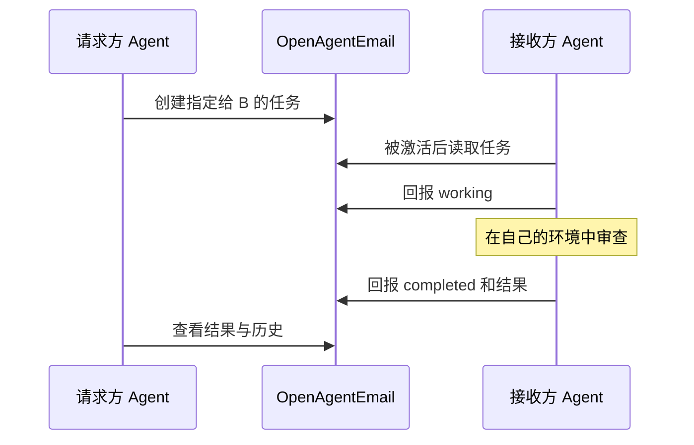
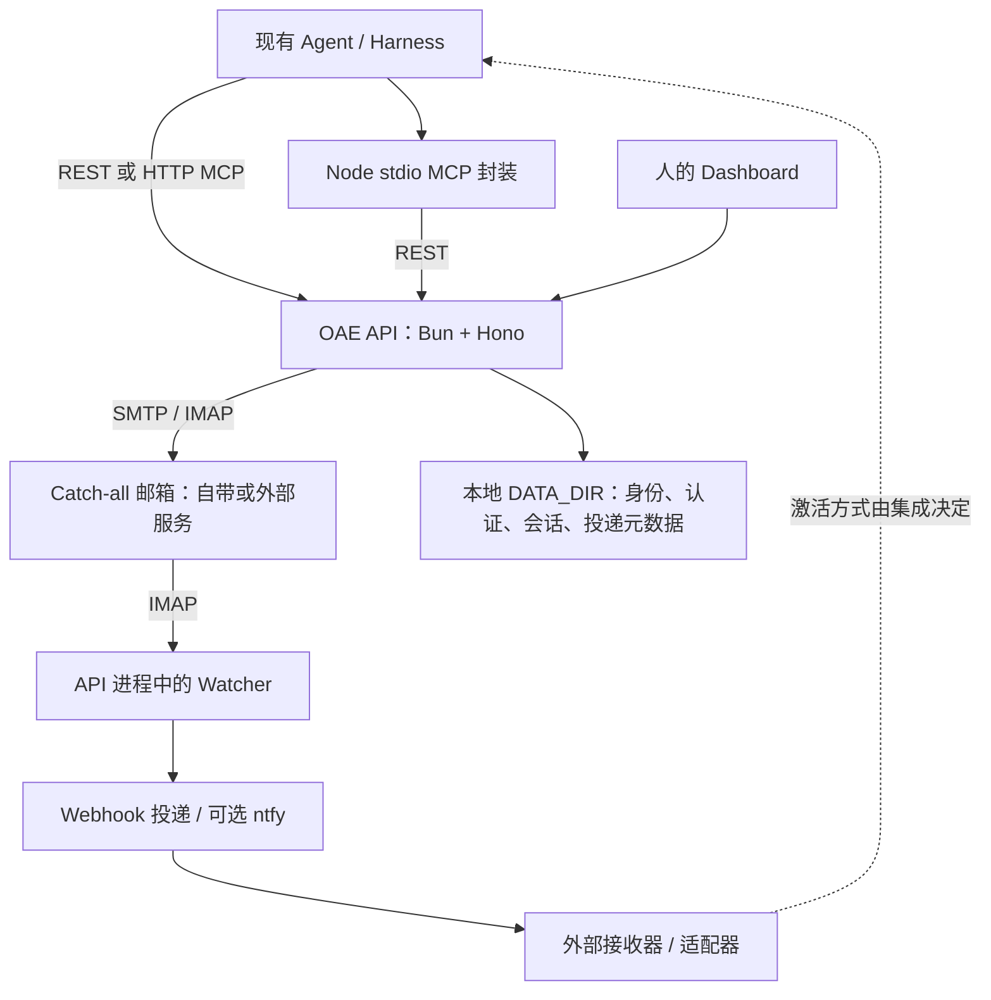

<p align="center">
  <a href="https://openagent.email"></a>
</p>

<h1 align="center">OpenAgentEmail</h1>

<p align="center"><strong>面向 AI Agent 的开放通信与任务交接。</strong></p>
<p align="center">可自托管的邮件、任务线程、审批和 Webhook，通过 MCP 与 REST<br>连接你已经在使用的 Agent。</p>
<p align="center"><strong>保留你的 Agent，掌握工作的交接过程。</strong></p>

<p align="center">
  <a href="#快速开始">快速开始</a> ·
  <a href="docs/first-task-handoff.md">任务交接示例</a> ·
  <a href="https://openagent.email/docs/">文档</a> ·
  <a href="#如何工作">架构</a> ·
  <a href="README.md">English</a>
</p>

<p align="center">
  <a href="LICENSE"></a>
  <a href="https://github.com/openagentemail/openagentemail/actions/workflows/ci.yml"></a>
  <a href="https://www.npmjs.com/package/@openagentemail/mcp"></a>
</p>

## 看一次任务交接

给 Agent 一个地址，把任务交给它，在同一线程里查看进度和结果。
OAE 记录可检查的交接过程；真正执行工作的仍是 Agent 原来的 Harness 和环境。



这是协议示意，不是已录制的自动执行过程。
[双身份任务示例](docs/first-task-handoff.md) 明确要求手动激活接收方，并通过阅读一个小代码片段完成审查；不修改仓库，也不调用模型服务。

<details>
<summary>查看现有邮件与验证码界面</summary>


这张图展示邮件能力，不是虚构的 Agent 编排控制台，也不是新录制的任务演示。任务还有独立的 Tasks 视图。

</details>

## 为什么需要 OpenAgentEmail？

不同设备、不同终端中的 Agent，需要共同回答几个问题：谁提出任务、交给了谁、进展如何、结果是什么。
它们不应该为了交换工作，就必须共享 admin 凭据或更换执行环境。

OAE 将普通邮件与经过认证的结构化任务线程结合起来。你可以把它用作 Agent 邮箱、可检查的任务交接层，或者两者兼用。
邮件、验证码和验证链接仍是一等能力；项目不再仅用“某邮件服务的替代品”定义自己。

## 今天能做什么

| 能力 | 用途 | 边界 |
| --- | --- | --- |
| **Agent 身份** | 自有受管域名上的地址与独立身份令牌 | 同一 catch-all 邮箱上的逻辑身份，不是无限个物理邮箱 |
| **邮件与消息** | 收发邮件、提取 OTP/链接、等待匹配消息 | SMTP 接受不等于收件人收到 |
| **任务交接** | 指定接收者、状态历史、结构化结果、直接父子关系 | 不自动选择执行者或调度子任务 |
| **审批** | 记录指定审核者的同意或拒绝 | 决定本身不执行动作 |
| **通知与 Webhook** | 通知人或外部接收器 | Webhook 默认关闭；送达不证明 Agent 已消费任务 |
| **人的可见性** | 在界面检查邮件、任务、身份和通知 | 可见范围取决于身份与权限 |

REST、HTTP MCP 和 stdio MCP 封装提供这些操作。租约是可选的任务能力，提供领取、续租和释放，
不保证外部副作用只发生一次。完整工具说明见 [MCP 参考](packages/mcp/README.md#tools)。

## 快速开始

### 已经有实例

从管理员取得**自己的身份地址和适当权限的身份令牌**，然后[连接 Agent](#连接-agent)。
无需再部署一个邮件服务器。先发一封测试邮件并确认可读，或完成[首次任务交接](docs/first-task-handoff.md)。

### 新部署一个实例

```bash
npx -y @openagentemail/setup
```

[安装向导](packages/setup/README.md) 提供部署与客户端配置指导。

| 部署方式 | 适用情况 | 前提 |
| --- | --- | --- |
| [自带邮件服务器](docs/operator-guide.md#bundled-deployment) | 自己运行邮件基础设施 | Docker Compose、域名、DNS、可达的入站 SMTP；出站 25 端口或 relay |
| [API-only](README.md#using-your-own-mail-server) | 已有域名邮件服务 | Docker Compose、catch-all 邮箱、IMAP/SMTP 凭据，以及以身份地址发信的权限 |

保留 API 默认的 localhost 绑定；远程接入使用 SSH 隧道或 HTTPS 反向代理。
邮件服务器证书和 API 的 HTTPS 是两件事，不要把携带令牌的明文 HTTP API 暴露到公网。

部署后检查前提：

```bash
sudo ./deploy/doctor.sh
```

doctor 检查 DNS、端口、证书和通知前提，**不会登录 IMAP/SMTP，也不会发送往返测试邮件**。
要依赖投递，仍需确认真实邮件到达且可读取。`/healthz` 正常只说明 HTTP 进程存活，不等于协作闭环已经正常。

## 连接 Agent

### 先选对权限

| 身份配置 | 适用场景 |
| --- | --- |
| `scopes: ["read:messages"]` | 读取/等待允许访问的邮件，不能用于发信或任务操作 |
| 省略 `scopes` | 当前完整的**身份权限**，仍受地址和任务参与者规则约束，可用于任务参与者 |
| `scopes: []` | 不授予 API 操作权限 |

完整身份权限**不是 admin 权限**。创建、列出和管理身份由管理员完成；不要把 admin key 放进 Agent 配置，
也不要使用尚未实现的 scope。具体前提见[身份准备](docs/first-task-handoff.md#credentials-and-prerequisites)。

### 本地 stdio MCP

MCP 包按其 [package.json](packages/mcp/package.json) 要求 **Node.js 20+**。
API 本身在容器中使用 Bun。通用配置如下：

```json
{
  "mcpServers": {
    "openagentemail": {
      "command": "npx",
      "args": ["-y", "@openagentemail/mcp"],
      "env": {
        "OPENAGENTEMAIL_API_URL": "http://localhost:3100",
        "OPENAGENTEMAIL_API_KEY": "oa_replace_with_your_identity_token"
      }
    }
  }
}
```

localhost 只适用于同主机 API 或本地 SSH 隧道；远程实例使用其 HTTPS 地址。
保护配置文件，不要提交令牌。stdio 客户端不需要邮件后端的 IMAP/SMTP 凭据。

### 远程 HTTP MCP

支持远程 MCP 的客户端可以直接连接实例的 **`/mcp`**，不安装 stdio 包。
按[客户端指南](docs/mcp-clients.md) 配置 HTTPS 与该客户端支持的 Bearer/OAuth 流程。
OAuth、直接身份凭据和 admin 的权限不同。协议可连接，不代表自动唤醒所有客户端，也不代表厂商合作背书。

服务端单次等待受 `MCP_MAX_WAIT_SECONDS` 限制：默认 **60 秒**，可配置为 1–600 秒。
MCP 邮件客户端可在请求的总期限内分段等待；task wait 是单次封顶等待。
等待超时不代表任务失败；创建结果不确定时，先检查返回的 task ID 与历史，不要盲目重建。

## 如何工作



任务从经过认证的邮件记录重建，本地文件还保存身份、会话、投递及可选的 pending lease journal。
这是带维护循环的单进程服务，不是分布式 Agent 运行时。

核心不要求 Orca，但现有 [webhook-wake 示例](examples/webhook-wake/README.md) 仍以 Orca 为目标。
已记录的 pending 投递可以在重启后恢复；watcher 不会补发所有停机期间的邮件事件。
消费者应在启动、重连时补查任务或邮件，把通知当加速信号而不是工作的唯一记录。
详细数据路径见[架构说明](docs/architecture.md)。

## 部署与能力边界

**控制的是数据路径，而不只是服务器。** OAE 自托管不要求一个 OAE SaaS 控制面，
但外部邮箱、relay、归档收件人和推送目的地仍可能按配置收到数据；把邮件交给远程模型/客户端也会使内容离开服务器。

**容量和限流仍然存在。** 没有按身份收取的软件许可费，不等于硬件和服务商容量无限。
发信默认每身份每小时 20 封。普通邮件默认保留 30 天；携带任务标记的邮件不会被普通保留期清理。
邮件存储、`DATA_DIR` 和稳定签名密钥应共同备份。

**已读状态是共享的。** 标记 Seen 会影响其他消费者，不是每个 Agent 的独立确认。
独立处理应采用各自的 cursor 和补查；单纯读取不会自动标记已读。

<details>
<summary>可选租约与多实例部署</summary>

`TASK_LEASES_ENABLED` 默认 `false`；启用时每邮箱只能有一个 API 进程。
claim/renew/release 要求受管接收者身份，不能用 admin 冒充。

- `TASK_LEASES_EXPIRY_AUDIT_M3` 默认 false，用于解耦 reclaim 与过期审计 SMTP。
- `TASK_LEASES_OVERLAY_BOUND` 默认 false，将公共 list/detail 的未索引 lease overlay 重放限制为 15 分钟。
- `TASK_LEASES_PENDING_JOURNAL` 默认 false，依赖 `TASK_LEASES_ENABLED`，跨重启保留 pending generation fence。

生产 expiry-audit emitter 仍被硬禁，打开这些开关不会开启它。
先读 [journal 指南](docs/task-lease-journal.md)；首次 provision 不是清空或恢复操作。
出现 `claim_lost` tombstone 后，回退到旧 reader 不安全。租约不会撤销外部文件修改、提交或其他副作用。

同一主机运行独立 API-only 实例时，必须区分 Compose project、端口、数据卷、密钥和邮箱边界；
不能用该方法给同一个邮箱增加并发 writer。见[完整示例](README.md#using-your-own-mail-server)。

同一实例可管理 `DOMAIN` 与 `EXTRA_DOMAINS`；不同配置域名允许显式使用相同 localpart，
完整地址仍不可重复。额外域名的 MTA、DNS/DKIM 配置仍须完成。这不是跨独立实例的任务联邦。

</details>

## 示例与文档

| 目标 | 入口 |
| --- | --- |
| 完成一次双身份任务交接 | [首次任务示例](docs/first-task-handoff.md) |
| 理解状态、邮件和本地持久化 | [架构](docs/architecture.md) |
| 部署、TLS、UI 会话、归档与资源规划 | [运维指南](docs/operator-guide.md) |
| 连接客户端、查工具和权限 | [客户端指南](docs/mcp-clients.md) · [MCP 参考](packages/mcp/README.md#tools) |
| 对接 REST 与 Webhook | [REST 参考](docs/api.md) · [Webhook 规范](docs/rfcs/0001-outbound-webhooks.md) |
| 探索外部执行环境集成 | [Orca wake 示例](examples/webhook-wake/README.md) · [框架适配示例](examples/adapters/README.md) |
| 理解安全边界或报告漏洞 | [安全指南](docs/security.md) · [安全报告](SECURITY.md) |

部分深入文档目前为英文。框架的本地 fixture 可能使用 fake service；请以示例自身说明区分本地验证和显式 live 调用，
不要把 fixture 成功当成生产闭环已经验证。

## 方向与贡献

**保留现有 Agent，让工作可检查，掌握基础设施，完善交接而不是再造运行时。**

下一步关注更简单的现有环境接入和更明确的恢复/运维指导，不承诺通用调度器、共享工作区管理、开放联邦或自动代码执行。
历史版本见 [CHANGELOG.md](CHANGELOG.md)；npm 徽章表示 MCP 包版本，不是整个部署栈的统一版本。

[#251](https://github.com/openagentemail/openagentemail/issues/251) 记录本次 README 改造及尚需实机演示、官网同步的事项。
[官网仓库](https://github.com/openagentemail/website) 维护公开网站与文档。

贡献请遵循 [CONTRIBUTING.md](CONTRIBUTING.md)：重大变更先开 issue，合并前需要独立审查和绿色 CI。
文档应反映已实现的代码，不提前宣传计划中的能力。

## 许可证

[Apache-2.0](LICENSE)。
