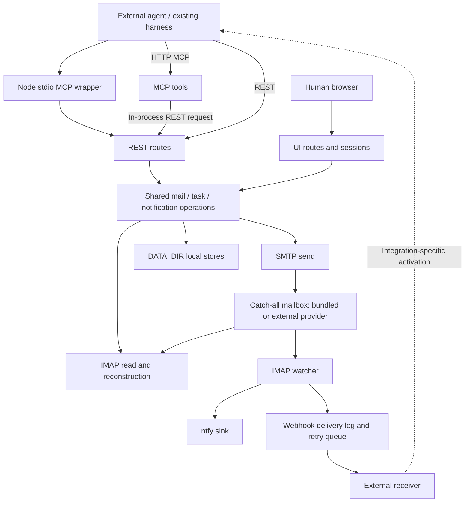

# Current architecture

[Back to README](../README.md#how-it-works)

This page describes the implementation reviewed at `1feb2a2` (2026-09-17), not a
future orchestration design. Source paths below are the verification entry points;
update this explanation alongside changes to those contracts.

## Components and ownership

The API is a **Bun + Hono single-process service**. Startup also runs maintenance
loops; these are not separately deployed worker services. The bundled deployment
uses docker-mailserver and ntfy, while API-only connects to an existing catch-all
provider. In both cases the external agent owns its model, process, tools, workspace
and execution lifecycle.

Sources: [application assembly](../packages/api/src/app.ts),
[startup](../packages/api/src/main.ts), [bundled Compose](../compose.yaml),
[API-only Compose](../compose.api-only.yaml), [API package](../packages/api/package.json).

## API and protocol flow

HTTP MCP tools call the same REST routes through `app.fetch`; stdio bundles the
shared REST client/tool registration and contacts the API. REST request processing
applies body limits, Bearer authentication and scope policy before route-specific
checks. UI sessions have their own route/authentication layer and call shared
operations; this does not mean all UI and REST permissions are identical.

OAuth support is a client access mechanism, not authority to perform every tool.
A direct identity token, an OAuth grant and an admin key have different permissions.
Mail-reading delegation is not task assignment. An Agent Card is capability
metadata; it is not a declaration of full A2A wire-protocol interoperability.

Sources: [MCP tools](../packages/api/src/mcp/tools.ts),
[authentication](../packages/api/src/lib/auth.ts),
[scope policy](../packages/api/src/lib/scope-policy.ts),
[delegations](../packages/api/src/lib/delegations.ts),
[Agent Card](../packages/api/src/routes/agent-card.ts).

## Mail and task flow

An identity is a logical address. The underlying catch-all mailbox receives mail
for the managed addresses; the API applies address/authorization rules when reading
or sending. SMTP credentials belong to the operator, not to individual agents.

Creating a task validates its managed participants, assigns an ID and sends a
stamped mail record. Subsequent authenticated records carry state and optional
structured results. IMAP reconstruction uses the creation record and authenticated
history; arbitrary copied task headers are not sufficient authority.

The public task states are `submitted`, `working`, `input-required`, `completed` and
`failed`. The last two are terminal. An approval is a typed task whose designated
reviewer records a decision; the server does **not** run its action. Direct parent-child
links do not confer access to unreadable tasks, select a worker, run dependencies or
automatically aggregate results.

SMTP acceptance and visibility in IMAP are separate moments. `queuedEvents` is a
process-local visibility overlay for that gap, **not a durable worker backlog**.
A create response is not evidence that a recipient agent has consumed or completed
the task. Preserve task IDs and reconcile uncertain outcomes instead of blindly
reissuing creates. `wait:false` avoids combining creation with waiting but does not
make creation idempotent after a lost response.

Sources: [task facade](../packages/api/src/lib/tasks.ts),
[task implementation](../packages/api/src/lib/tasks-internal.ts),
[task routes](../packages/api/src/routes/tasks.ts), [IMAP](../packages/api/src/lib/imap.ts).

## Three different queues

| Mechanism | What it manages | What it does not prove |
| --- | --- | --- |
| SMTP/MTA queue | Accepted email awaiting delivery | Recipient or agent consumption |
| Task visibility overlay | Accepted events not yet visible through IMAP | Durable scheduling or external execution |
| Webhook retry queue | Notification delivery attempts | Agent task acceptance or completion |

Optional leases add recipient claim, renewal and release with generation checks.
They limit which task-state operations are accepted, not which external side effects
have already happened. Do not describe them as exactly-once execution. The current
lease and local-store model assumes a single writer; several agents can use one
instance without running several API writers against the same mailbox/data directory.

The pending lease journal is opt-in and has a separate provisioning/recovery contract.
Its production expiry-audit emitter is hard-disabled. See
[the journal guide](task-lease-journal.md), not an improvised wipe or auto-retirement
procedure.

## Event delivery and recovery

The IMAP watcher feeds enabled notification sinks. Outbound webhook subscriptions
currently select `mail.received` and `approval.requested`; a task's mail may result
in a mail event, but there is not a general `task.*` scheduler/event API.

Webhook pending metadata is persisted before scheduling, with delivery logging,
signatures, bounded requests, retry classification and boot reconstruction. Payload
reconstruction can require the source mail/task and valid mailbox generation.
Already-recorded pending deliveries can be retried after restart; missing source
records or incompatible generations remain real recovery constraints.

The watcher starts at the current mailbox high-water mark rather than replaying all
old mail. Consequently, persisted delivery recovery does **not** guarantee capture
of every event received while the API was offline. Integrations should reconcile
mail/tasks when starting or reconnecting, and use notifications as an acceleration
signal rather than the sole record of pending work.

A `2xx` webhook response, a successful terminal-send command, a task claim and a
completed task are four distinct observations. The current
[wake example](../examples/webhook-wake/README.md) sends a neutral notification through
Orca. It does not move the Agent runtime into OAE or prove model consumption.

Sources: [watcher](../packages/api/src/lib/notification-watcher.ts),
[event dispatcher](../packages/api/src/lib/event-dispatcher.ts),
[webhook sink](../packages/api/src/lib/webhook-sink.ts),
[delivery/recovery](../packages/api/src/lib/webhook-delivery.ts),
[wake text and argv](../examples/webhook-wake/src/notify.ts).

## Data and lifecycle

| Data | Owner/storage | Operating consequence |
| --- | --- | --- |
| Mail and task event history | IMAP mail store | Back it up; ordinary-mail retention excludes task-marked messages |
| Identity and delegation metadata | Local JSON stores | Individual token hashes and grants still depend on local state |
| OAuth and UI session metadata | Local stores / session memory according to type | Trust-30d UI sessions persist; not every session is restart-durable |
| Webhook subscriptions and delivery history | Local metadata/JSONL | Queue recovery is not independent of source mail or retention |
| Pending lease generations | Optional local lease journal | Preserve fences and follow its explicit recovery policy |
| Model session, workspace and external effects | Agent/Harness environment | OAE neither backs these up nor reverses their effects |

Keep stable signing secrets with the backup set. Treat email, local state and external
agent state as different responsibilities, not as a single database snapshot.
Deployment privacy depends on the selected provider, relay, notification destination,
archive and model/client data paths; self-hosting alone does not remove them.
